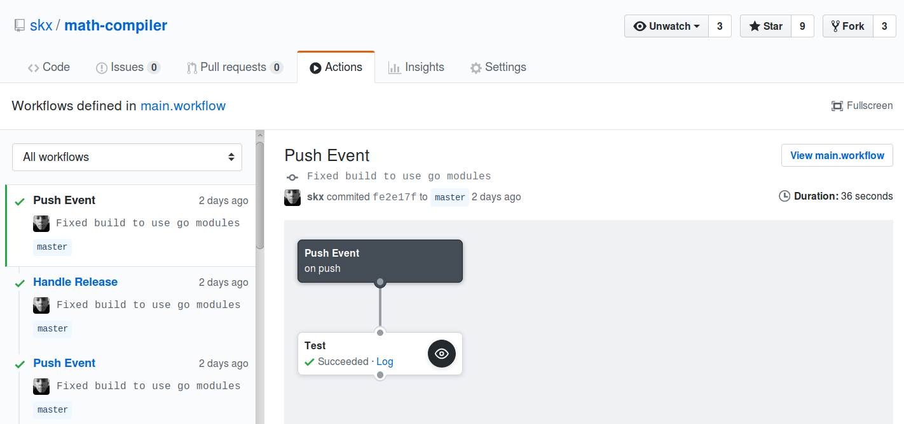

# GitHub Action for Running tests

This repository contains a simple GitHub Action implementation, which allows you to run a shell-script every time a pull-request is created/updated, or a commit is made to your repository.

The expectation is that this script will run your project-specific tests, and
the exit code will determine the success/failure result.  A golang-project might contain nothing more than `go test ./...`, while a C-based project might include `make && make test`.


## Enabling

There are two steps required to use this action:

* Create the file `.github/main.workflow` in your repository.
  * This is where you enable the action, and specify when it will run.
* Create the shell-script `.github/run-tests.sh` in your repository, to run your actual tests.
  * The exit-code of this script will determine the result.


## Sample Configuration

The following sample `.github/main.workflow` file will run tests when commits are pushed __and__ when pull-requests are submitted/updated:

```
# pushes
workflow "Push Event" {
  on = "push"
  resolves = ["Execute"]
}

# pull-requests
workflow "Pull Request" {
  on = "pull_request"
  resolves = ["Execute"]
}

# Run the magic
action "Execute" {
  uses = "skx/github-action-tester@master"
}

```

You don't need to have both sections, but of course if you don't enable the action for at least one case then nothing will happen!


## Sample Configuration & Output

With these two configuration-files I have configured my [math-compiler](https://github.com/skx/math-compiler) project to run tests every time a commit is pushed, or a new pull-request is created/updated:

* [.github/main.workflow](https://raw.githubusercontent.com/skx/math-compiler/master/.github/main.workflow)
  * This enables the action, and triggers it to run on pushes or pull-requests.
* [.github/run-tests.sh](https://raw.githubusercontent.com/skx/math-compiler/master/.github/run-tests.sh)
  * This actually runs some tests.
     * First of all a standard `go test ./...`
     * Then a custom functional-test which exercises the application.

These runs look like this:


